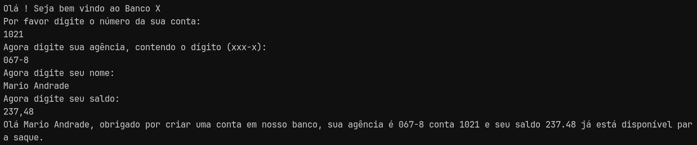

# Desafio - Simulando Uma Conta Bancária Através Do Terminal/Console

- [x] Crie o projeto `ContaBanco` que receberá dados via terminal contendo as características de conta em banco conforme atributos abaixo:
- [x] Dentro do projeto, crie a classe ContaTerminal.java para realizar toda a codificação do nosso programa.
- [x] Permita que os dados sejam inseridos via terminal sendo que o usuário receberá a mensagem de qual informação será solicitada.
- [x] Depois de todas as informações terem sido inseridas, o sistema deverá exibir a seguinte mensagem: *"Olá [Nome Cliente], obrigado por criar uma conta em nosso banco, sua agência é [Agencia], conta [Numero] e seu saldo [Saldo] já está disponível para saque".*
**Os campos em [ ] devem ser alterados pelas informações que forem inseridas pelos usuários.**

## Resultado
___
